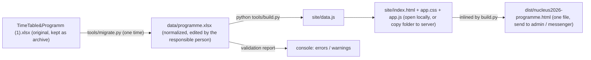

# ЯДРО-2026 Conference Programme: MVP plan

## What we have and what the research says

- Source: `TimeTable&Programm (1).xlsx` = hand-drawn grid (`TimeTable`, 147 merged cells) + `Plenary talks v2` (32 plenary, 2 jubilee, 3 sponsor talks) + 7 section sheets (158 talks, grouped by day/slot, with chair) + `Постерная секция` (47 posters). No rooms, no per-talk times inside section slots, grid and sheets disagree in several places (see "Data issues" below). Conclusion: the grid must be **generated** from the talk list, never edited by hand again.
- Best-practice features seen in Indico (the tool physicists know), pretalx, Skedz, Lanyard, Flow Grid: day tabs, room/track columns on desktop collapsing to a time-ordered list on mobile, "now/next" marker, track filter + search, favourites without login (localStorage), add-to-calendar (.ics), offline PWA, print view, "last updated" stamp, QR code, embeddable widget.
- Accessibility: apply the cheap, sensible defaults only (readable base font ~16-17px, good contrast, comfortable tap targets, keyboard/ARIA basics, colour never the only cue). No special "senior mode"; the A/A+ font toggle stays because it costs nothing.
- Hosting: GitHub/Google had repeated access degradation in Russia in 2026, so the MVP is a static package for the conference's own site; no runtime dependency on external services (locally bundled font, inline SVG icons, no CDN).
- Look and feel: the user wants a modern 2026 interface, not an Indico-style table. Current design consensus is "calm UI" (whitespace, content first, minimal chrome), dark mode as a first-class theme, structural motion, token-based colours, bottom tab bar / bottom sheets on phones - see the Design direction section.
- Tooling: Python 3.12 + openpyxl already present and sufficient; no Node/conda needed. Site = vanilla HTML/CSS/JS, no build step, runs from `file://`. (If a later feature needs extra packages, I will state them explicitly rather than assume.)
- Bilingual: the conference is international, so the whole UI, day/time formats, block names (coffee break, lunch, excursion...), section names and chairs exist in both RU and EN; talk/poster titles and speaker names are shown as submitted (RU or EN), as is normal for Indico-hosted physics conferences.

## Architecture

## Repository layout (new)

- `data/programme.xlsx` - single source of truth (Russian column headers, one row per item)
- `data/original/` - copy of the current workbook (original left untouched in root; it is open in Excel now)
- `tools/migrate.py` - one-time import original -> `data/programme.xlsx`, prints everything that needed a judgement call
- `tools/build.py` - `programme.xlsx` -> `site/data.js` + `dist/*.html`; validates and refuses to build on hard errors
- `site/index.html`, `site/app.css`, `site/app.js`, `site/data.js` (generated)
- `README.md` (Russian) - how to edit, rebuild, test locally, publish; `.gitignore` for `~$*.xlsx`, `dist/`

## Normalized workbook `data/programme.xlsx`

Sheets (all Russian headers, first row = header, one row = one record):

Bilingual convention: every human-readable *structural* text has a pair of columns `... (RU)` / `... (EN)`; if EN is blank the RU text is shown in English mode (and vice versa), so the sheet never blocks the build. Talk titles and names have a single column and are shown as submitted.

- `Настройки`: название (RU/EN), даты, город (RU/EN), часовой пояс (Asia/Vladivostok, UTC+10), URL сайта, контакт оргкомитета, текст сноски (RU/EN).
- `Секции`: № (1-7, P = пленарные), краткое название (RU/EN), полное название (RU/EN), председатель (RU/EN), цвет (pre-filled), аудитория по умолчанию (blank for now).
- `Блоки` - the timetable blocks exactly as the committee thinks about them: Дата | Начало | Конец | Тип (fixed vocabulary: пленарный / секция / перерыв / обед / регистрация / открытие / закрытие / постеры / мероприятие; translated automatically) | Название (RU) | Название (EN) (e.g. "Экскурсия на теплоходе" / "Boat excursion") | Секция | Доклады (range like `8-14`, or `12` for a plenary) | Аудитория | Примечание (RU/EN).
- `Доклады` - flattened talks: ID (stable, e.g. `S1-08`, `P-12`; assigned by migration, never changed) | Секция | № | Фамилия | Имя (отчество) | Организация | Название | Длительность (мин; blank -> 15 for section, 30 plenary, 20 jubilee, 15 sponsor) | Начало (optional override) | Статус (blank / отменён / перенесён) | Примечание (RU/EN).
- `Постеры`: ID (`POST-05`) | Фамилия | Имя | Организация | Название | Секция | № стенда (blank for now).
- `Изменения`: Дата/время | Текст (RU) | Текст (EN) - shown on the site as "Изменения в программе / Programme changes" (important during the conference).

Build rules: a section block with `Доклады = 8-14` pulls talks 8..14 of that section; per-talk start = block start + sum of previous durations (unless overridden). A plenary block with `Доклады = 12` pulls plenary talk 12. Everything in the grid (including "(8-14)" labels) is derived, so moving a talk = changing one number. Reordering talks changes their №, never their ID, so participants' stars keep pointing at the right talk.

Validation in `build.py`: duplicate or missing IDs, unknown talk numbers, talks not placed in any block, a talk placed twice, block durations exceeded by talk sum (warning), overlapping blocks in the same room, duplicate speaker+title, missing required cells, missing EN text (warning only). Errors stop the build with a readable message; warnings are printed.

## Site features (MVP)

Layout and navigation
- Header: conference name/dates, "Обновлено / Updated: <дата>" stamp from build time, RU | EN switch (switches all UI text, day names, date/time formats, block/section names; remembered in localStorage; also settable via `?lang=en` so the website can link straight to the English programme), A/A+ font-size button (persisted).
- Sticky day tabs Пн 21 ... Сб 26 / Mon 21 ... Sat 26; auto-selects today during the conference; "Сейчас / Далее" ("Now / Next") summary at top of today's tab; the current block is highlighted (device clock converted to UTC+10, footnote "local time, Khabarovsk").
- Views: Расписание (day timeline) | Секции (full programme of each section, as chairs and speakers want to see it) | Постеры | Поиск | Моё.
- Day timeline = list of blocks in time order (not a pixel-proportional grid; simpler and more robust on phones). A block with parallel sections renders as up to 4 side-by-side columns on >= 900px and as stacked cards on phones. Each section card shows colour stripe + "Секция 1 · Структура ядра · ауд. ... · доклады 8-14" and expands to the talk list with times, speaker, affiliation, title. Plenary blocks show speaker + title directly. Breaks/social events are muted rows with small inline icons.
- Section filter chips (multi-select) that dim other sections; search across speakers/titles/affiliations for all days with links into the schedule; alphabetical speaker index inside Поиск.
- Talk detail (expand/modal): full title, speaker, affiliation, section, date, time, room, №, status badge (отменён / перенесён).

Personalisation without login (how it works and survives updates)
- Star talks -> "Моё / My schedule" tab. Stars are saved in the browser's localStorage on the participant's own device, keyed by the stable talk ID (`S1-08`), never by time or №. Rebuilding the site after a programme change does not touch them: a moved talk keeps its star and shows its new time (+ "перенесён / moved" badge when the status column says so); a removed talk is shown once as "removed from programme", then dropped.
- Known limits, stated in README and in a one-line hint on the tab: stars are per device/browser and per site address (stars made on the local `file://` copy will not appear on nucleus.togudv.ru). Mitigations included in MVP: "Share my schedule" link (`#my=S1-08,P-12,...`) that re-creates the stars on another device, and `.ics` export of starred talks or the whole programme (client-side Blob, works from file://). Real cross-device sync would need a server/login and is out of scope.
- Print stylesheet: clean A4 programme day by day, controls hidden (printed booklet, people who prefer paper).
- "Изменения в программе / Programme changes" panel from the `Изменения` sheet.

Robustness
- Readable defaults (16-17px base, AA contrast palette for 7 sections with number + name always shown, comfortable targets, ARIA tabs, visible focus, `prefers-reduced-motion`).
- Zero external requests (font bundled locally, base64-inlined in the single-file build); runs from `file://`, from any static hosting, or embedded in WordPress via `<iframe>` (embed snippet in README). Single-file `dist/` build for sending via messenger.

Deferred (documented in README as next steps, not built now): service worker for true offline cache (adds stale-cache risk during the conference), QR-code poster, per-talk abstracts/PDF links, auto-deploy to the website, optional server-side sync of favourites.

## Design direction ("2026 design vision", explicitly not Indico)

Reference feel: Linear / Notion / Apple Calendar - calm, content-first, minimal chrome; the programme is the hero, the UI recedes. Everything below is implemented with plain CSS/JS (design tokens as CSS custom properties), still zero external requests.

Typography
- Bundled variable typeface with Cyrillic-first design, served locally from `site/assets/fonts/` (one woff2): Onest (OFL) as first choice, Inter as alternative if Onest lacks tabular numerals; system-font fallback stack if the download is not possible from this machine. Fluid type scale with `clamp()`; tabular numerals for all times; strong hierarchy: large day heading, medium talk title, small muted meta (speaker, affiliation, room).
- Titles currently typed in ALL CAPS ("ОСТАТОЧНОЕ НЕЙТРОН-ПРОТОННОЕ...") look dated and shouty. Migration converts all-caps titles to sentence case once, protecting tokens with digits/symbols and a list of known acronyms (NICA, SPD, BM@N, MPD, HEP, GERDA, JUNO, СКМ, МэВ, ...), and prints every converted title for review; the editor fixes any acronym the heuristic missed directly in the sheet.

Colour and themes
- Token-based palette in OKLCH: light and dark themes (auto from `prefers-color-scheme` + manual toggle, persisted). Neutral surfaces (off-white / soft graphite, never pure black), one accent colour (a single variable, so it can later be matched to the conference site), and 7 section hues generated at equal lightness/chroma so they sit together harmoniously; each section has tint (card background), stripe (saturated edge) and text-safe variants that pass AA in both themes.

Layout and navigation
- Mobile-first, app-like: bottom tab bar with icons on phones (Расписание / Секции / Постеры / Поиск / Моё), slim top bar on desktop. Sticky translucent header (restrained frosted-glass blur) holding the day pills with a sliding active indicator.
- Day view: a vertical time rail with dots and a live "now" line; blocks are cards (14-16px radius, hairline border, soft layered shadow). Parallel sections form a bento-style grid (1-4 columns via container queries); the plenary block is one wide card with the speaker and title set large; breaks and social events are low-emphasis rows with small icons.
- Small per-day summary under the day heading ("5 plenary talks · 4 parallel sections · welcome party").
- Talk detail opens as a bottom sheet on phones and a centered dialog on desktop (`<dialog>`), with room, time, section, star and add-to-calendar actions.

Motion (structural, never decorative; all disabled under `prefers-reduced-motion`)
- Smooth expand/collapse of section talk lists; crossfade/slide on day and view switches (View Transitions API where supported, CSS fallback); hover lift on cards; small pop on the star; the "now" marker breathes subtly.

Details
- Consistent inline SVG icon set (Lucide, ISC licence), friendly empty states ("Nothing starred yet - tap the star on any talk"), micro-copy in both languages, print stylesheet stays plain and clean.

## Data issues found (migration will use section sheets as truth and report these)

- Grid numbering off by one vs sheets: Section 1 Fri (grid 24-30, sheet 23-29), Section 2 Fri (31-37 vs 30-36), Section 4 Fri 16:15 (22-27 vs 22-28), Sections 5/6 Wed (grid 1-7, sheets have 9 and 8 talks).
- Расулова appears in Section 1 (№18) and Section 2 (№18); Пухаева has 3 consecutive talks in Section 3; Родкин and Варламов listed on two plenary days (leftover rows Wed 46/48) - migration keeps the later placement, flags them.
- Typos ("закрыттие", "19::00", "обед."), Section 7 Friday block is only "секция 7" at 16:45 without a range (assumed talks 22-24), poster session time ambiguous (grid "Постеры" Wed ~17:15) - flagged for your confirmation.
- No rooms; kept as optional columns.

## Verification

- `python tools/build.py` passes on migrated data; validation report reviewed.
- Open `site/index.html` and `dist/nucleus2026-programme.html` via `file://`; check in the Cursor browser at desktop width and at a 390px phone viewport, in both RU and EN and in light and dark themes: day tabs, parallel columns/cards, filters, search, favourites, .ics download, print preview; take screenshots for you to judge the look before polishing.
- Favourites survival test: star a talk, change its № / day in the spreadsheet, rebuild, reload - star must still be on the same talk at its new time.
- Spot-check counts: 158 section talks, 32 plenary, 47 posters all present exactly once.
