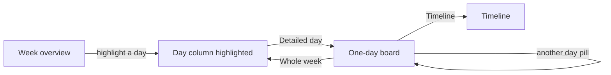

# Detailed day board

No new navigation tab. Overview stays the week grid. After a day column is highlighted, a day-bar button opens a one-day board on the same page. The link is `#view=schedule&layout=day&day=YYYY-MM-DD`, so it can still be opened in another browser tab, but the button itself does not.

Chairs and rooms already live on each block (`chairOf`, `roomOf` in [site/app.js](site/app.js)). Section-level chairs in the data are empty; the board uses the sitting chair.

## How it opens

- In [renderDaybar](site/app.js), when `layout === 'overview'` and `overviewFocus` is set, show a `daybar-action` button **Подробный день** / **Detailed day**.
- That button sets `layout` to `'day'` and keeps `state.day`. The Лента | Сетка control stays; Сетка stays pressed, because this is still the overview family. Pressing Сетка, or the button once it reads **Вся неделя** / **Whole week**, returns to the week grid with that day still highlighted.
- Day pills on the board switch the day and stay in this layout.
- Hash: `writeHash` / `applyHash` accept `layout=day`. `setLayout('overview')` from this layout restores `overviewFocus` to `state.day` instead of clearing it.

## The board

Reuse `mergeDayBands`, `overviewTicks`, and `overviewSectionClusters`, but only for the selected day. One time column, one day column, up to four parallel section panes (the current maximum). Same section colours and room order (library, assembly hall, 117л, 315л).

Each block shows:

- **Sections:** `S1`, short name, room, sitting chair. Sittings shorter than 60 minutes use one line (`S7 · 315л · И. О. Фамилия`) so a 30-minute cell still fits the time scale.
- **Other events** (registration, opening, plenary band, poster, social, closing): existing label plus room. If every item in the band shares one chair, show that chair too (plenary and opening sittings). Breaks stay label-only.

Tapping a cell still highlights its time range, as on the week grid.

## Smooth switch

`withTransition` is a no-op today because replacing `#main` fights the View Transitions API. This switch only replaces the overview grid and the footer print control, so a real transition fits:

1. Fade the non-focused day columns.
2. `document.startViewTransition` with one shared name on the focused `.overview-day` and the new one-day board, so the column expands into the board.
3. Update the footer print button inside that same callback.
4. Reverse on the way back: the board shrinks into the highlighted column, then the other days fade in.
5. `prefers-reduced-motion` or no `startViewTransition`: swap immediately.

## Footer

[setLayout](site/app.js) does not call `renderFooter` today, and the print label only distinguishes the sections view. The day board must switch it:

- Label becomes **Печать дня** / **Print this day**.
- `renderPrint` emits that day only: one landscape A4, conference title, full date, colour section blocks, scaled to the page the way the week overview print already is in [renderPrintOverview](site/app.js). Type stays large enough to post in the hall (not the week sheet’s 7pt).
- Returning to the week grid restores **Версия для печати** and the existing six-day landscape sheet.
- Website, install, and calendar export stay as they are.

Printing each remaining day is: open the day, print. Four days means four A4 sheets.

## Files

- [site/app.js](site/app.js) — layout state, hash, day-bar button, `viewDayBoard`, richer cells, transition helper, print branch, RU/EN strings.
- [site/app.css](site/app.css) — one-day grid, stacked section text, compact sittings, `data-print="day"`, view-transition timing.