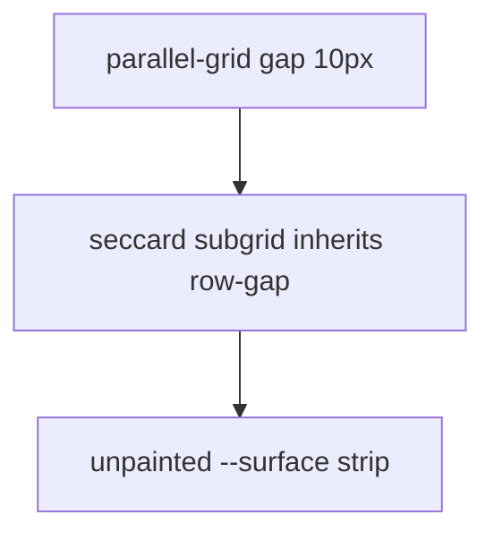

# Fill timeline section cells to the divider

There is no separate design behind the leftover strip. Parallel sections share one CSS grid so headers and same-time talks line up. That grid uses `gap: 10px` to space **cards** apart. Because each [`.seccard`](site/app.css) is a **subgrid** of that parent, the same 10px becomes a gutter **inside** the card — between the tinted `.sechead` and the first talk, and between talks. The card background (`--surface`, white in light mode) shows there; the orange left stripe still runs through it (`::before` is `inset: 0`). The 1px `border-top` on `.talk` is the real divider.

Talks already try to fill their **row** (`.seccard > .talk { height: 100% }`), but nothing paints the **gap**. Shorter headers can also fail to stretch (`.sechead` is a `<button>`).

## Change (CSS only)

In [`site/app.css`](site/app.css), keep 10px **between** section cards; drop the gutter **inside** them.

1. On `.parallel-grid`, split `gap: 10px` into `column-gap: 10px; row-gap: 10px`.
2. In the `@container (min-width: 560px)` block (expanded subgrid), set `row-gap: 0` on `.parallel-grid` and on `.parallel-grid:not(.is-collapsed) .seccard`. Column gap stays 10px so neighbouring cards do not touch.
3. Make paint fill the aligned cell:
   - `.sechead { height: 100%; }` (already has `align-self: stretch`; `height: 100%` makes the button actually fill when a neighbour header is taller).
   - Keep `.seccard > .talk { height: 100%; align-self: stretch; }`.

Talk `border-top` stays as the subtle line. Header tint meets that line; hover/`is-now` meets the next line or the rounded card bottom (`overflow: hidden` on `.card`).

No JS, data, or print-layout changes. Rebuild `dist/` with `python tools/build.py` after (local preview only; no FTP).

## Verify

- Timeline, expanded parallel slot (e.g. Section 3): tint reaches the first talk’s top border; no white band. Dark mode: no `--surface` band either.
- Hover a short talk next to a wrapped title: hover fills the whole cell, including the bottom, up to the next divider.
- Last talk in a card: hover reaches the rounded bottom; stripe still full-height.
- Collapsed headers, mobile stack (&lt;560px, no subgrid), and spacing **between** section cards stay as they are.
