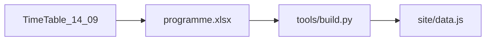

# Ingest TimeTable 14.09

Source: [TimeTable&Programm_14_09.xlsx](TimeTable&Programm_14_09.xlsx). Edits go only into [data/programme.xlsx](data/programme.xlsx), then `python tools/build.py`. No FTP. **Surviving talk/poster IDs stay put**; talks that 14.09 dropped are **deleted from the book**, not kept as cancelled slots.

Your decisions: Tuesday 16:15 **S2 Assembly Hall, S3 library** (updated 14.09: TimeTable `библиотека`, sheet «Читальный зал библиотеки»). **Follow 14.09 numbered lists**, restore P-23. Cancelled orals **leave the schedule entirely** (no strike-through leftovers in timeline, section lists, or search).

Block end = **15 min × talks still in the block**. Do not copy TimeTable merge heights blindly.

## 1. Rooms and labels

In [tools/common.py](tools/common.py) `ROOM_LABELS` / `expand_room`:

- `235ц` — unchanged (`235ц, Актовый зал` / `235ц, Assembly Hall`)
- **Retire the `144ц` tag.** It used to mean the library. The public label is now only `Читальный зал библиотеки` / `Library reading hall` (no room number). Canonical spreadsheet code: `библиотека`. If a block still says `144ц`, expand it to the same pair so `144ц` never appears on the site
- `117л`, `315л` — unchanged
- New `вестибюль`: `Вестибюль, 1 эт.` / `Central lobby, 1st floor`
- New `холл2`: `Коридор и холл 2-го этажа` / `Hallway, 2nd floor`

Write codes on «Блоки → Аудитория» (still not on «Секции»).

**S1** (library except Friday hall):

- Mon 16:15, Tue 14:00, Wed 14:00 → `библиотека`
- Fri 14:00 → `235ц`

**S2** (Assembly Hall every slot, including Tue 16:15):

- Mon 16:15, Tue 14:00, Tue 16:15, Wed 14:00, Fri 16:15 → `235ц`

**S3:**

- Mon 16:15, Fri 14:00, Fri 16:15 → `117л`
- **Tue 16:15 → `библиотека`** (14.09 no longer puts S3 in the hall next to S2)

**S4:** Tue `117л` / Fri `библиотека` (was `144ц`).

**Unchanged rooms:** S5 `117л`, S6/S7 `315л`, all plenary/opening/jubilee/sponsor/closing `235ц`.

**Registration** (Mon 08:00–09:00): `вестибюль`.

**Poster session:** `холл2`.

Tuesday 16:15 rooms (no double booking): S2 `235ц`, S3 `библиотека`, S4 `117л`, S7 `315л`. `build.py` will warn if two blocks still share a room.

## 2. Posters

Clear `Статус` on `POST-13, 19, 21, 24, 25, 26, 47` (still orange in 14.09; others will present).

Optional notes from column E: `POST-13` «представит Гаганов», `POST-21` «представит Залозная».

Close the `POST-23` / `POST-34` duplicate question in [data/inconsistencies.md](data/inconsistencies.md) — same title is intentional.

## 3. Oral lists — delete dropped talks, renumber survivors

Do **not** keep `отменён` placeholders with unused numbers. They must not appear on the day grid, in the section programme, or in search.

**Delete these «Доклады» rows** (IDs go away with them):

- `S1-28` Мардыбан, `S1-29` Безбах А. Н. — absent from 14.09
- `S2-01` Данилов, `S2-09` Каманин — absent from 14.09
- `S4-09` Бытьев — unnumbered orange leftover of a talk that is out of the numbered list; remove from our book
- `S4-13` Uzikov — **not a cancellation**. The orange unnumbered row is a leftover after he was **deleted from the Excel table**. Delete our `S4-13` row too; `#13`/`#14` on the sheet stay empty

**S1.** Friday «Доклады»: `23-27` (5×15 → **15:15**; grid still 15:45 — build will warn).

**S2** after those deletions and moving Галюзов to Monday (change `№` on surviving IDs):

- Monday 16:15 `1-7`: Демьянова←2, Соловьев, Куликов, Шахов, Егоров, Яников, **Галюзов** (`S2-23` → №7)
- Tue 14:00 `8-13` (skip empty 14): Изосимов 8, Tran←10, … Федоров `S2-14` → №13. Six talks → **15:30**
- Tue 16:15 keep `15-17,19-21`. Sheet has two `#19` and empty `#21` — typo: Давыдов 19, Титова 20, Любашевский 21 (same people as now)
- Wed `22-28` (skip empty 29): Музалевский←24 … Рыжков `S2-29` → №28. Seven talks → **15:45**
- Fri `30-36` unchanged

**S4.**

- Tue 16:15 `8-12`: Андронов 8, Герасименюк←10, Зайцев, Скородько, Фризен `S4-14` → №12. Five talks → **17:30**
- Other S4 slots `1-7`, `15-21`, `22-28` unchanged

**Plenary order (change `№` only, keep IDs):**

- Thu 18–23: Воронин, Пшеничнов, Гаганов, Картавцев, Боос, **Варламов**. Un-cancel `P-23` (he is back in the Thursday slot)
- Sat: Дзюба №30, Ефимов №31, Родкин №32 (`P-30`/`P-31` swap numbers)
- Wed afternoon: **keep Апарин** `P-15` (Physics opportunities… SRC / Nuclotron). The plenary sheet has two identical Апарин rows (41 leftover `1_Structure`, 42 with chair Черняев) plus an empty row — that empty/duplicate is **not a 30-minute hole**. TimeTable still has three packed talks: 11:00 Апарин, 11:30 Свирихин, 12:00 Балдин. Drop the duplicate row only; do not insert a gap or drop Апарин. Chair for that sitting: Черняев А. П.

After this, the site should have **no cancelled orals**. Posters that were cancelled are restored (section 2), not deleted.

## 4. Plenary session chairs

14.09 column E is a **session** chair, not a section owner. «Секции» chairs for 1–7 stay empty (those sheets still have `Секция N (count)`, not people). Do not put Чувильский & co. back as section chairs.

Add `Председатель (RU)` / `Председатель (EN)` to «Блоки» ([tools/common.py](tools/common.py) `COLS_BLOCKS`, [tools/build.py](tools/build.py), README). Repeat the session chair on every plenary/jubilee/sponsor/opening block in that sitting:

- Mon opening+jubilee: Купряшкин И. В.
- Mon 11:00: Чувильский Ю. М.
- Mon 14:00: Сидорчук С. И.
- Tue 09:00: Титова Л. В.
- Tue 11:00: Чувильский Ю. М.
- Wed 09:00: Жеребчевский В. И.
- Wed 11:00: Черняев А. П. (not the leftover `1_Structure`)
- Thu 09:00: Нестеренко В.
- Thu 11:00: Яковлев С. Л.
- Fri 09:00: Пшеничнов И. А.
- Fri 11:00: Мочалов В. В.
- Sat 09:00: Мазур А. И.

EN from names already in the book where possible (`Yu. M. Tchuvil'sky`, `S. I. Sidorchuk`, …); otherwise bilingual fallback to RU.

[site/app.js](site/app.js): `chairOf(block)` = block.chair, else section.chair. Show it on plenary detail (today `sec.id === 'P'` hides chair) and print meta for plenary slots. Section 1–7 timeline can keep using section.chair (still «уточняется»).

## 5. Docs, cache, verify

- [data/inconsistencies.md](data/inconsistencies.md): 14.09 rooms; library / registration / poster hallway; posters restored + duplicate OK; deleted orals (including Uzikov leftover, not cancelled); plenary chairs live; empty «не приедут» oral list
- One «Изменения» row (rooms, restored posters, chairs, list updates)
- [.gitignore](.gitignore): `TimeTable&Programm_14_09.xlsx` (same as 11.09)
- README: room catalog + block chair columns
- Bump `site/index.html` `?v=` and `CACHE` in [site/sw.js](site/sw.js)
- `python tools/build.py`; check warnings for shorter S1 Fri / S2 Tue morning / S4 Tue afternoon
- Browser: Overview lanes, parallel cards rooms, registration lobby, poster hallway, library as «Читальный зал библиотеки» / «Library reading hall» with **no `144ц`**, no cancelled orals, posters live, plenary chairs, P-23 live, no FTP
