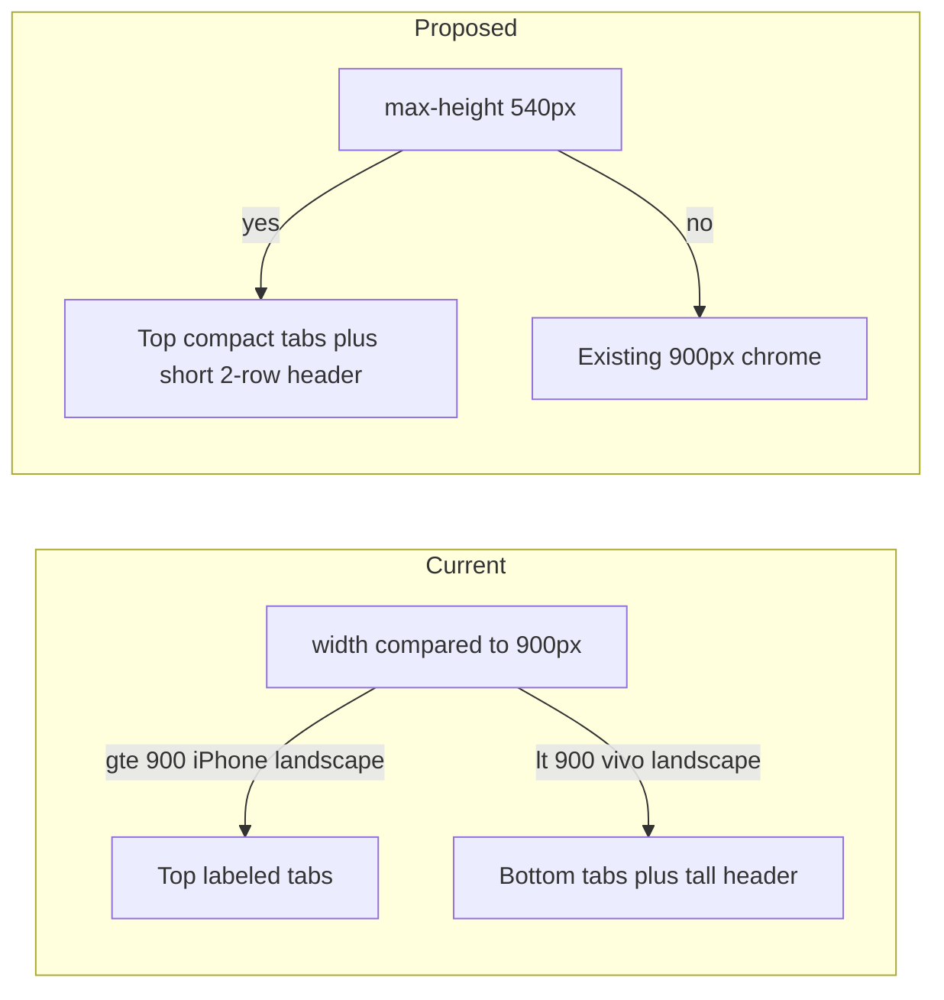

# Compact chrome for mobile landscape

## Why the two devices disagree

Chrome vs Android is a **width breakpoint**, not “phone vs desktop”:

- Tabs live in two places already: `#nav-desktop` in the first header row, `#bottom-nav` fixed at the bottom ([site/index.html](site/index.html)).
- CSS shows the top nav and hides the bottom bar only at **`min-width: 900px`** ([site/app.css](site/app.css) ~275–276 and ~710–718). JS `isDesktop()` uses the same query for section expand / click behavior — that must stay as-is.
- iPhone 16 Pro Max landscape is **956×440**, so DevTools already uses the desktop top nav.
- The vivo screenshot is **720–899px wide** (subtitle and “Изменения” are visible, bottom bar is still shown). Sticky chrome is then ~60px topbar + 56px daybar + 64px bottom bar ≈ **180px** on a ~400px-tall screen.

There are **no** `orientation` / `max-height` UI rules today.



## Approach (CSS-first)

Add one compact-chrome query in [site/app.css](site/app.css), placed **after** the existing 560/720/900 rules so it wins:

```css
@media (max-height: 540px) { ... }
```

Height is the real constraint (landscape phones, browser UI, split screen). It will also compact iPhone-landscape-in-DevTools (440px tall), which is useful even though tabs are already on top there.

**Do not** fold this into `isDesktop()` / `min-width: 900px`. Landscape phones should keep mobile section-card accordion behavior.

### 1. Move tabs to the top row

Reuse `#nav-desktop` (already filled by `renderNav()`):

- `.nav-desktop { display: flex; }`
- `.bottom-nav { display: none; }`
- `body { padding-bottom: 0; }`
- Same for toast / install banner: sit at `bottom: 16px` instead of `var(--bottom-nav-h) + …`

Make those tabs **compact** so they fit between brand and controls at ~800px:

- Smaller padding / font; allow the row to shrink (`.brand { flex: 0 1 auto }` instead of eating the row).
- Hide `.brand-sub` (the Khabarovsk line is what makes the first row feel “desktop-tall” on the vivo).
- Hide `.ctl-label` (“Изменения”) even though width ≥ 720px.
- If five labeled pills still overflow on ~667px-wide landscape, hide tab text with `.nav-desktop .tab > span:not(.count)` and keep icons + the “My” count badge.

### 2. Shorten the two sticky rows

Override tokens in the same query (sticky offsets for `.slot-time` / `.day-chunk-head` already use them):

- `--topbar-h: 44px` (today 60px, or 72px below 560px)
- `--daybar-h: 40px` (today 56px)

Also shrink the controls that force those heights:

- `.brand-mark` ~28px, `.ctl` ~32px
- `.daypill` ~32px tall (keep ПН / 21 two-line, slightly tighter)
- Slightly reduce `.main` top padding

Target sticky chrome on the schedule view: **~84px** instead of ~180px.

Non-schedule views already hide `#daybar`; they get a single compact top row plus top tabs.

## Files

- **[site/app.css](site/app.css)** — the compact-chrome media query (nav, heights, brand/controls/daypills, toast, install banner).
- **[site/app.js](site/app.js)** — no logic change unless a tab label needs a class for reliable CSS (prefer a `span.label` in `renderNav()` only if `:not(.count)` is too fragile).
- **[site/index.html](site/index.html)** — no structural change; both nav mounts stay.

## Verify locally (no FTP)

Use Chrome device mode (responsive / custom size), not a deploy. Modern phones are **19.5:9** (~2.17, iPhone 16 class) or **20:9** (~2.22, many Androids including vivo X200 Ultra). In landscape that is a **short** viewport: height is width × 9/19.5 or width × 9/20. Check **both sides of the 900px width split**, because that is what currently decides bottom vs top tabs.

Landscape (compact chrome must apply; timetable must have usable height, not two header rows plus a bottom bar):

- **19.5:9, width ≥ 900:** iPhone 16 Pro Max **956×440**. Tabs already on top today; header must still shrink. Content (not chrome) should dominate the 440px height.
- **19.5:9, width under 900:** custom **845×390** (390 × 19.5/9). This is the iPhone-like ratio with vivo-like mobile chrome. Bottom bar gone, compact tabs in row 1.
- **20:9, width ≥ 900:** custom **915×412** (common Android CSS). Same as desktop tabs + compact short header.
- **20:9, width under 900:** custom **850×382** (850 × 9/20). Closest to the vivo X200 Ultra screenshot: this is the worst case (~382px tall). After the change, sticky chrome ~84px; before, ~180px with the bottom bar.

Portrait (compact chrome must **not** apply; bottom tabs stay):

- **19.5:9:** iPhone 16 Pro Max **440×956**, plus **390×845**.
- **20:9:** **412×915** and **382×850**.

Also: desktop **≥900×700** unchanged. Spot-check Sections / Search / My (daybar hidden) and toast position after starring an event, at least on **850×382** and **956×440**.

Browser verification of these viewports is required before calling it done.