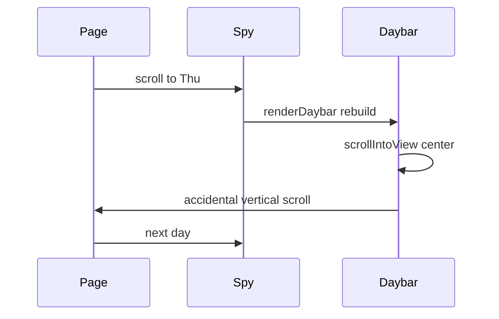

# Maps, details copy, tour dismiss, week-tape spy

No FTP. Test locally (`site/index.html` or `python -m http.server`). Bump `app.css` / `app.js` query in [`site/index.html`](site/index.html) (currently `?v=19`), `ASSET_V` in [`site/app.js`](site/app.js) (currently `'12'`), and `CACHE` in [`site/sw.js`](site/sw.js) (currently `nucleus2026-v15`).

## 1. Bilingual map links + English pier preview

[`SOCIAL_MAPS`](site/app.js) currently has one `url` per venue, both `yandex.com`. Change to lang-keyed URLs:

- Pier: RU [`https://yandex.ru/maps/-/CTxFFCyL`](https://yandex.ru/maps/-/CTxFFCyL), EN [`https://yandex.com/maps/-/CTxFF0KI`](https://yandex.com/maps/-/CTxFF0KI)
- Dinner: RU [`https://yandex.ru/maps/-/CTxF5SOM`](https://yandex.ru/maps/-/CTxF5SOM), EN keep [`https://yandex.com/maps/-/CTtxZMZe`](https://yandex.com/maps/-/CTtxZMZe)

`mapPreview()` should pick `venue.url[state.lang]` (fallback the other language). Recapture [`site/assets/maps/pier-en.png`](site/assets/maps/pier-en.png) from the new EN short link (Yandex Static Maps, English labels, same style as the existing RU/EN PNGs). Leave dinner previews and `pier-ru.png` unless the new RU pier pin clearly differs.

## 2. “Link to this event” for non-talks

Keep talk/poster details on `copyLink` (“Ссылка на доклад” / “Link to this talk”).

Add `copyLinkEvent` (“Ссылка на событие” / “Link to this event”) and use it in `openBlockDetail` (excursion, dinner, any future block sheet). Classification is already `block.type` vs talk/poster: block sheets are events.

## 3. Android: “Open in Yandex Maps” flashes then vanishes

The screenshot matches a Chromium layout bug: `.map-preview { overflow: hidden }` plus `img { aspect-ratio: 16 / 9 }` sizes the card to the image only, then clips the sibling `.map-open`. First paint shows the caption; after aspect-ratio settles it is gone (or a sliver at the image bottom). The long EN string also overflows a phone-width row.

Fix in CSS + copy, not a JS workaround:

- Keep the link as a `position: relative` card; put the caption **on** the image (`position: absolute; left/right/bottom: 0`) with a solid/gradient bar so it lives inside the image box and cannot be clipped as a sibling.
- Allow wrapping (`flex-wrap`) and slightly smaller type on narrow sheets.
- Shorten `openMap` to **«Яндекс Карты»** / **«Yandex Maps»** (external icon still means “open”).

The map image stays the hit target.

## 4. Skip the tour on outside tap

[`#tour-root`](site/app.css) is `pointer-events: none`; `.tour-layer` already eats outside clicks and does nothing. In `ensureTourDom` / `bindTourChrome`, click (and pointerup) on `.tour-layer` → `endTour('skipped')`. Clicks on `.tour-card` stay on the card. Escape / Skip already skip.

## 5. Mobile week-tape highlight (keep sliding tape)

Chosen approach: keep the overflowing tape; fix the spy.

**Cause:** `syncDayFromScroll` calls `renderDaybar()`, which **rebuilds** all pills (kills CSS selected transitions, resets `scrollLeft` to 0) then `scrollIntoView({ inline: 'center', behavior: 'instant' })`. Mon–Wed are already on-screen, so this is a no-op. Thu–Sat force a horizontal jump. On Android Chrome, `scrollIntoView` on a nested scroller also nudges the **page**, the spy fires again, and the highlight skips/dashes.

**Fix** in [`site/app.js`](site/app.js) / [`site/app.css`](site/app.css):

- Split paint vs selection: full `renderDaybar()` only when structure changes (view/layout/lang). Spy and in-timeline `setDay` only toggle `aria-selected` on existing pills so the existing background/color transition can play.
- Never use `scrollIntoView` for pills. Scroll **only** `#day-tabs` / `.daybar-inner` via `scrollTo({ left, behavior })`. If the selected pill is already fully visible, do not scroll. Otherwise scroll just enough to reveal it with padding (not always-center, which yanks Sat and the layout switch).
- Smooth, slower tape motion (`scroll-behavior: smooth` on the inner bar, or a ~400–500ms `scrollTo`); respect `prefers-reduced-motion`.
- Keep `ignoreDayObs` around programmatic page scrolls; tape-only `scrollLeft` must not move the document.

Verify on a narrow viewport: scroll timeline Mon→Sat and back, tap a later day, switch Timeline/Overview (tape may still slide to show the layout control). Check dinner + excursion sheets in RU/EN for the correct maps URL and a stable caption. Do not deploy.