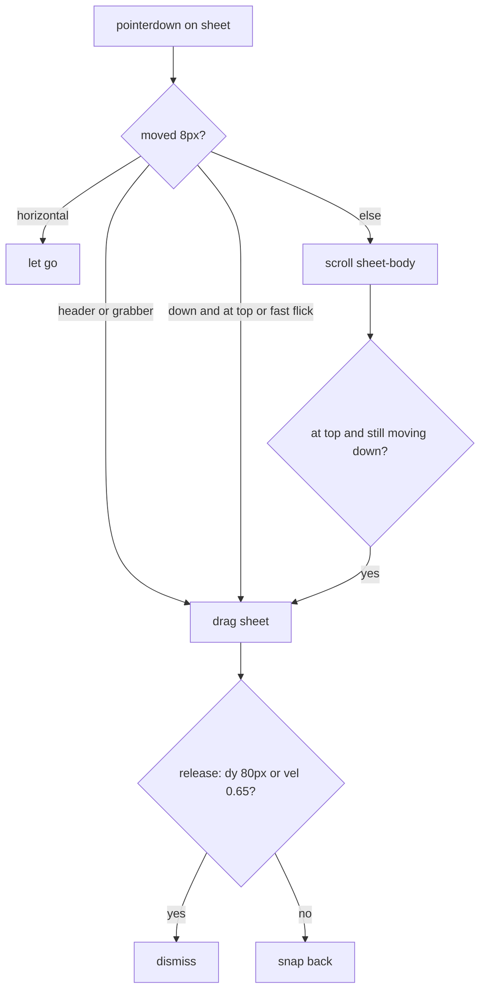

# Align sheet swipe vs scroll, stop close-time auto-scroll

Both issues live in [`site/app.js`](site/app.js) + [`site/app.css`](site/app.css) and only show below the mobile sheet breakpoint (`max-width: 720px`). Desktop skips `lockBodyScroll()` (`isDesktop()` at 900px) and does not bind sheet-drag.

## 1. Swipe in the middle of the card scrolls instead of closing

Dismiss currently starts only from the grabber/header, or from `.sheet-body` when `scrollTop === 0`:

```1907:1916:site/app.js
    function sheetOrigin(e) {
      ...
      if (t.closest('.grabber, .sheet-head')) return { sheet, fromBody: false };
      const body = t.closest('.sheet-body');
      if (body && body.scrollTop <= 0) return { sheet, fromBody: true };
      return null;
    }
```

The grabber/header have `touch-action: none`; the body does not. A finger in the **middle of the card** is a native pan, so the browser often `pointercancel`s the drag (even at the top) and the card scrolls or rubber-bands instead of following the finger.

**Intended behaviour**

- Slow vertical drag on overflowing content: scroll the card.
- Downward drag at the top of the content, or a **fast downward flick anywhere** on the sheet (except buttons/links): drag/dismiss.
- Header/grabber: always drag-to-dismiss.



**Implementation**

- Track from the whole `.sheet-inner` (still ignore `.sheet-close`, actions, links, buttons).
- On mobile, set `touch-action: none` on `.sheet-inner` so the browser cannot steal the gesture (`pointercancel`).
- After the 8px slop, choose **drag** vs **scroll**:
  - drag if the touch started on grabber/head, or `ddy > 0` and (`scrollTop <= 0` or velocity already over `SHEET_FLICK`)
  - otherwise apply the move to `sheet-body.scrollTop`
  - if scrolling hits the top while the finger is still moving down, switch the remainder into a sheet drag
  - if a short downward move later exceeds `SHEET_FLICK` (~280ms window), promote scroll → drag and restore `scrollTop` to the value at pointerdown so the flick does not first jump the text
- Keep existing dismiss thresholds (`SHEET_MIN = 80`, `SHEET_FLICK = 0.65`) and the snap/dismiss animation.

## 2. Open/close auto-scroll (looks like a jump from an earlier day)

This is the classic `position: fixed` body lock plus **`html { scroll-behavior: smooth }`**.

```530:547:site/app.js
  function lockBodyScroll() {
    if (isDesktop()) return;
    ...
    document.body.style.top = `-${y}px`;
    document.body.dataset.scrollY = String(y);
  }
  function unlockBodyScroll() {
    ...
      document.documentElement.classList.remove('is-sheet-open');
      document.body.style.top = '';
      window.scrollTo(0, y);
```

```203:203:site/app.css
html { -webkit-text-size-adjust: 100%; scroll-behavior: smooth; }
```

On close, removing `position: fixed` drops `window.scrollY` to **0** (start of the timeline / previous days). `window.scrollTo(0, y)` then **smooth-scrolls** back. That matches “so fast I cannot see where it started — I think from the previous day.” Desktop never locks the body, so it never happens there.

Two extra amplifiers:

- [`showSheet`](site/app.js) calls `showModal()` **before** `lockBodyScroll()`, so the UA may scroll the page toward the `<dialog>` at the end of `index.html`.
- Dialog focus restoration and the day IntersectionObserver can fire during that jump and fight the restore (`renderDaybar` also calls `scrollIntoView` on the selected pill).

**Implementation**

- Call `lockBodyScroll()` **before** `showModal()`.
- In `unlockBodyScroll()`, force an instant restore: `html.style.scrollBehavior = 'auto'` (or `scrollTo({ top: y, behavior: 'instant' })`), then clear the inline style after a frame. Re-apply `scrollTo` in rAF so a later focus-restore cannot leave the page at 0.
- Set `ignoreDayObs` for a short window around lock/unlock so the day observer does not retarget Monday and haptic/re-render the day bar.
- After close, `focus({ preventScroll: true })` the opener if it is still in the document (talk/poster card).

## Verify (mobile viewport only)

Use the in-IDE browser at ~390×844 (and a second check ~360×800):

- Open a short talk from mid-Tuesday: background must not jump; close via X, backdrop, and swipe — page stays on the same talk, no scroll animation from day 1.
- Overflowing sheet (long title/note): slow drag scrolls; quick downward flick on the body dismisses; pull-down at the top drags the sheet.
- Header grabber still drags; Star / copy-link taps still work.
- Repeat on a later day (Thu/Fri) so a restore-from-0 bug would be obvious.

Local only (`site/index.html` or `python -m http.server 8080 --directory site`). No FTP.