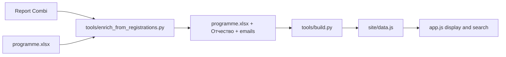

# Names, patronyms, and emails

Source of truth stays [data/programme.xlsx](data/programme.xlsx). Registration dump [Report Combi 2026-08-31 11_20_12(+0 UTG).xlsx](Report%20Combi%202026-08-31%2011_20_12(+0%20UTG).xlsx) (gitignored) is a lookup only. Do not rewrite the book from TimeTable; mixed names are already in `Доклады` / `Постеры` (e.g. `P-02` Richard / Ледницки). No FTP.



## Matching (strict)

One-shot script [tools/enrich_from_registrations.py](tools/enrich_from_registrations.py) with `--dry-run` then write:

- Index Report Combi `Worksheet` (header row 4: First Name, Last name, Email, Affiliation, Title, Section, Type). All 263 emails are filled; ignore `Approved?` if the person is already in the programme.
- Match last name via transliteration plus common variants (`ж/j`, `ье/ie`, `Alexey/Aleksei`, `Wang/Wong`-class fuzzy only with title support). **Never assign on last name alone** if the first-name token clearly disagrees (dry-run caught `S4-27` Anastasiia Васильева incorrectly glued to Алина Васильева).
- If several last-name hits: require first-token agreement, then title similarity.
- Same email reused across that person’s talks/posters is intended (Кондратьев: `S6-02`, `S6-03`, `POST-17`).
- Affiliation / org / phones: out of scope.

**Mixed script** (Latin first + Cyrillic last, 27 rows): replace **both** given name and surname from the matched registration row so the person is one script (Richard Lednicky, not Richard Ледницки). Then split patronym if present.

**Keep programme spelling** when it is already one script (do not Latinize Чувильский because the report says Tchuvilsky). Still copy email.

## Patronym column

Add **Отчество** after **Имя** on both `Доклады` and `Постеры`.

Split when the last token of Имя (or of Report “First Name”) looks like a patronym:

- Cyrillic: `ович` / `евич` / `ёвич` / `ич` (Ильич) / `овна` / `евна` / `ична`
- Latin: `ovich` / `evich` / `ovna` / `evna`

Do **not** split: `Huy Viet`, `Ngoc TOan`, `Md. Nure Alam`, `Абдулмажид Хусейн`; initials (`А. В.`, `Владимир Г.`, `Oleg I.`). Hyphenated given names stay in Имя (`Ангелина-Наталия` + `Валерьевна`). Empty Отчество is valid.

Schema updates: [tools/common.py](tools/common.py) `COLS_TALKS` / `COLS_POSTERS`; [tools/build.py](tools/build.py) emit `middle`; [tools/migrate.py](tools/migrate.py) column order and status-validation letters (talks status shifts K→L, posters I→J). [README.md](README.md) documents the column.

## Website

In [site/app.js](site/app.js):

```js
const speakerName = (x) => [x.first, x.middle, x.last].filter(Boolean).join(' ').trim();
```

Include `middle` in search haystacks (schedule search, poster filter) and in the speaker-index identity key so `Николаевна` and index chips still work. Cards, detail sheet, print, and `.ics` pick this up via `speakerName`.

Email on the detail sheet: `mailto:` when present; **omit** the row when empty (stop showing «уточняется» for people not in the dump).

Rebuild `site/data.js` locally. No deploy.

## Specials (confirmed)

Logged in [data/inconsistencies.md](data/inconsistencies.md) after the run.

- `S1-20` Yanzhao **Wong** → report **Wang** + `yanchzhao1@tpu.ru` (same title).
- `P-12` Колупаева: report has First/Last swapped (`Kolupaeva` / `Ludmila`). Keep `Людмила Дмитриевна Колупаева`, take `kolupaeva@jinr.ru` by title.
- `P-01` Джолос ↔ `Jolos`; `S4-14` Фризен ↔ `Friesen`: match by title/translit; mixed `S4-14` becomes all-Latin from the report.
- `P-S2` `А. В. Пашков` → `Александр` + `Владимирович` from the unique plenary match.
- `POST-44` `Надежда, Анатольевна` → strip comma, split patronym (same typo in the report).
- `S3-16` `Вмкторовна` → `Викторовна` (missing `и`; report is Latin `Olga` with no patronym).
- `S7-12` `Ulugbek Ashrapov` / `Ашрапов` → `Улугбек` + `Товфикович` + `Ашрапов`.
- **Расулова:** TimeTable 11.09 has her only on `1 Структура` №18. `S2-18` is a leftover in [data/programme.xlsx](data/programme.xlsx) (section 2 jumps 17→19). Delete the `S2-18` row; change the Tuesday 16:15 S2 block from `15-21` to `15-17,19-21` (do not renumber 19–21). Keep `S1-18`, email **`rasulova@jinr.ru`**. Close the “two sections” note in [data/inconsistencies.md](data/inconsistencies.md); the extra registration row `rasulova.inp@mail.ru` can stay as a dump curiosity.
- **Кондратьев:** one person. Two section-6 orals (`S6-02` динамо/нейтрино, `S6-03` намагниченность) plus poster `POST-17` «Безнейтринный двойной электронный захват…». TimeTable poster sheet already says `Владимир Николаевич`. Fix `POST-17` `Владимир Т.` → `Владимир` + `Николаевич`. Same email `vkondrat@theor.jinr.ru` on all three.

**Not in the dump (no email):** nobody else unmatched once Wang/Jolos/Friesen/Kolupaeva are wired. Double given names above stay without Отчество.

## Checks after build

- Search `Николаевна`, `Lednicky`, `Wang`, `Ильич`.
- Foreigner with no patronym still renders `First Last`.
- Detail sheet: mailto for Расулова (`rasulova@jinr.ru`) and all three Кондратьев items; no S2-18; no email row only if still unmatched.
- Speaker index still groups by surname (Lednicky under L, not Л).
