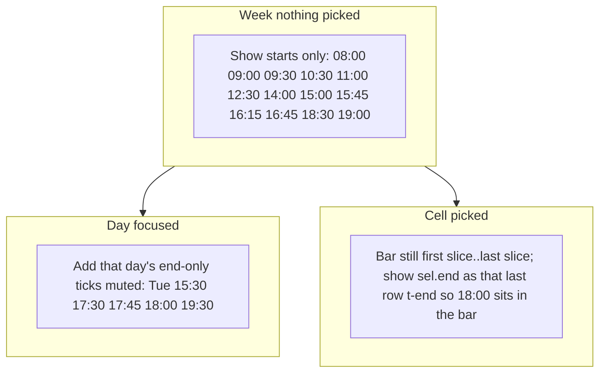

# Overview: hide ends until a day or event is selected

## Why it looks wrong today

The grid is still a **slice axis**: each row is `[a, b)` with **two** clocks ([`viewOverview`](site/app.js) ~1437–1448) — bold `.t-start` at the top (`a`) and muted `.t-end` at the bottom (`b`). [`applyOverviewTimeIdle`](site/app.js) only fades labels when a **day is focused**. On first open (whole week) every tick is drawn twice.

Merged bands (not raw talks) produce these **end-only** clocks — nothing *begins* then:

- **11:30** Saturday Closing
- **14:45** Friday S7
- **15:15** Friday S1
- **15:30** Tuesday S2 (morning)
- **16:00** Wednesday S1 / S6
- **17:30** Tuesday S4, Thursday boat
- **17:45** Tuesday S2, Friday S3
- **18:00** Monday/Tuesday/Friday sections + Wednesday poster
- **19:30 / 20:30 / 21:30** socials

So **16:45** is a real begin (poster) and stays bold. **17:45** is only an end, but it still sits as the begin of the tiny `17:45–18:00` row and is easy to miss.

**Poster vs lunch highlight.** The blue bar ([`.overview-range`](site/app.css)) spans rows where `a < sel.end && b > sel.start` — i.e. `[start, end)`. Lunch is one slice (`12:30–14:00`), so **14:00** is that row’s `.t-end` *inside* the bar. Poster is `16:45–18:00` with extra ticks at 17:30 and 17:45, so the visible **18:00** is the *next* row’s `.t-start` (`18:00–18:30`), **outside** the bar. Same issue when Monday S1 (`16:15–18:00`) is picked.

## Approach (no grid rebuild)

Keep slice rows and the two slots. Enforce **at most one visible label per minute**. Idle labels in week view too (today idle is `!!focus && …` only).

Rewrite [`applyOverviewTimeIdle`](site/app.js):

- **Week, nothing picked:** show `.t-start` iff that minute is a start of any overview cell. All `.t-end` idle. Hides 17:45, 18:00, 16:00, 11:30, etc.
- **Day focused:** show that day’s starts as `.t-start`. Show that day’s **end-only** minutes as `.t-end` (muted). If a minute is both (lunch 14:00, coffee 16:15), start style only — one label.
- **Cell picked:** always show `sel.start` as `.t-start` and `sel.end` as `.t-end` of the last overlapping slice; idle the **next** row’s `.t-start` when it is the same minute as `sel.end`. That puts poster **18:00** on the bar like lunch **14:00**. In week+pick, do **not** dump every end-only tick — only `sel.end` extra. Day+pick keeps the day’s ends, with the picked pair accented.

[`applyOverviewHighlight`](site/app.js) already accents `sel.start` / `sel.end` and builds the bar from overlapping slices — leave the bar span as-is; visibility is what makes 18:00 land inside it.

Call this after every focus/pick (already wired from `applyOverviewDayFocus` / `applyOverviewHighlight`). Opening Overview still clears day focus in [`setLayout`](site/app.js), so the first paint is start-only.

## Print

[`renderPrintOverview`](site/app.js) currently strips `.is-idle`, which would put every end back on the PDF. Keep `.is-idle` on time labels (still strip pick/focus/range) so print matches the uncluttered start-only week axis.

## Cache

Bump [`site/index.html`](site/index.html) `app.js?v=` 13 → 14 (JS). CSS only if a specificity tweak is needed so `.is-hl` stays visible over `.is-idle` (already later in [`site/app.css`](site/app.css)).

No `build.py`, no FTP.

## Check in the browser

- Overview first open: starts only; **16:45** visible (poster); **17:45 / 18:00 / 16:00 / 14:45 / 11:30** hidden
- Pick poster: bar **16:45–18:00** with **18:00** on the bar (same as lunch **14:00**)
- Pick Monday S1: bar through **18:00**
- Focus Tuesday: muted **15:30, 17:30, 17:45, 18:00, 19:30**; pick S2: **16:15–17:45** on the bar
- Focus Wednesday: muted **16:00**; **16:45** start; **18:00** when poster is picked
- Focus Saturday: muted **11:30** (Closing end, not a begin)
- Print Overview: start-only gutter, no pick chrome
