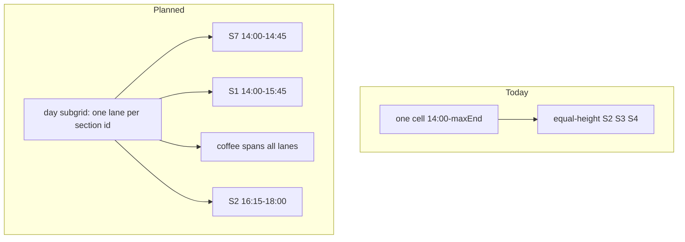

# Separate Overview section blocks by duration

Overview currently merges consecutive `type === 'section'` blocks into one rounded cell, then paints unique S# ids as **equal-height** flex panes ([`renderOverviewCell`](site/app.js), [`mergeDayBands`](site/app.js)). Height is the union envelope (`max(end)`), so Wed S2/S6 (to 16:00) and Fri S7 (to 14:45) are stretched to match their neighbours.

Stop grouping. Each programme section block becomes its own card. Height follows **that** block’s `start`/`end`. Parallel sections sit in **stable lanes** for the day: S2 stays in the same column before and after coffee; empty lane where a section is not running.

**Look (agreed from Friday preview):** independent rounded cards, **3px** gaps, no outer tray, empty lanes are the page background, coffee/plenary still full-width. No extra S1…S7 header row above lanes — the `S#` on the card is enough. Pick is a 2px accent ring on that card only (tint stays).

Unequal ends already in [`site/data.js`](site/data.js): Wed S1/S5 `14:00–16:15` vs S2/S6 `14:00–16:00`; Fri S7 `14:00–14:45` vs S1/S3/S4 `14:00–15:45`. Height uses **block** times, not summed talk durations.

Plenary / coffee / lunch / social stay as they are (merged talk-like bands; one full-width cell). Timeline is unchanged. No spreadsheet or FTP.

## 1. Stop merging section bands

In [`mergeDayBands`](site/app.js), drop the consecutive-section while-loop. Each section block is its own band `{ start, end, kind: 'section', items: [b] }`. Plenary merge via `TALK_LIKE` stays.

[`overviewTicks`](site/app.js) already unions every band start/end, so 16:00 and 14:45 become week ticks. Cells still `grid-row` span their own interval; a longer neighbour simply occupies more rows. Extra ticks on other days stay idle under day-focus (existing `.is-idle` logic).

Invalidate / rebuild `bandsByDate` as now (cache is per date; changing the merge function is enough if the map is empty at load).

## 2. Stable lanes: day subgrid

The week grid stays **one column per day** so days keep equal width (`minmax(7.2rem, 1fr)`). Inside each day, a wrapper spans all tick rows and splits into lanes:

- Lanes = unique section ids that appear that day, sorted numerically (Tue/Fri: S1 S2 S3 S4 S7; Wed: S1 S2 S5 S6; Mon: S1 S2 S3 S7). Days with no sections (Thu, Sat) get **one** lane so plenary/social stay full width.
- [`.overview-day`](site/app.css): `display: grid; grid-template-rows: subgrid; column-gap: 3px;` `grid-row: 2 / last-tick`. Children inherit the week tick rows so a 45 min block lines up with the gutter.
- Section cell: `grid-column` = that section’s lane; `grid-row` = its tick span (offset because the wrapper starts at parent row 2).
- Non-section cell: `grid-column: 1 / -1`.

No outer grey tray around parallel sections — empty lanes are just the page background.

## 3. Independent section cards

Replace `.overview-sec-split` / `.overview-sec-pane` with one `.overview-cell.section-block` per band:

- `data-color` on the cell (existing `--sec-tint` / `--sec-text`)
- label `S#`, `aria-label` = `S#` + short name
- own `border-radius` and 1px border (same `--r-sm` as other overview cells)
- compact padding so five lanes still fit `S7` in a ~7.2rem day column

`.overview-cell.is-picked { background: var(--accent-soft) }` must **not** wash out section tint. For `.section-block.is-picked`, keep `--sec-tint` and use only the 2px accent ring (plenary/social keep the current fill + ring).

## 4. Pick identity and time highlight

Today [`overviewSel`](site/app.js) is `{ day, start, end }` and [`applyOverviewHighlight`](site/app.js) marks **every** cell with that `day+start`. After the split, four 14:00 sections would all ring and the bar would use whichever `end` was clicked last.

Change:

- `overviewSel` → `{ day, start, end, section }` (`section` empty for plenary/break/social)
- Toggle off only when the **same** cell is clicked again (`day + start + section`)
- Clicking a sibling at the same start **switches** the pick
- `.is-picked` on that cell only
- `.overview-range` and `.t-start/.t-end.is-hl` use **that** cell’s `[start, end]` (Fri S7 → 14:00–14:45, not 15:45)

[`activateOverviewCell`](site/app.js) / [`overviewCellActivate`](site/app.js) / create-time `picked` in `renderOverviewCell` all use the new identity. Day-focus still dims other columns; idle times union **per-cell** starts/ends on the focused day (shorter ends now count).

Print still clones `.overview` and strips pick/range ([`renderPrintOverview`](site/app.js)); no print-specific layout rewrite.

## 5. Verify (local only)

`python tools/build.py`, then Overview in the browser:

- Wed afternoon: S2 and S6 stop at 16:00; S1 and S5 continue to 16:15; coffee still 16:15
- Fri afternoon: S7 stops at 14:45 beside full-height S1/S3/S4; after coffee S2/S3/S4 in the same lanes as morning (S2 empty before coffee, S1/S7 empty after)
- Click S7: ring on S7 only; time bar 14:00–14:45; click S1: bar extends to 15:45
- Click a plenary: full-width pick + interval as today
- Day-focus Friday: 14:45 visible; other days’ unused 14:45 idle
- Print overview: separate colored blocks, no pick chrome
- Mobile/narrow: horizontal scroll still works; S# readable in 5-lane days

No FTP unless you ask to publish.
