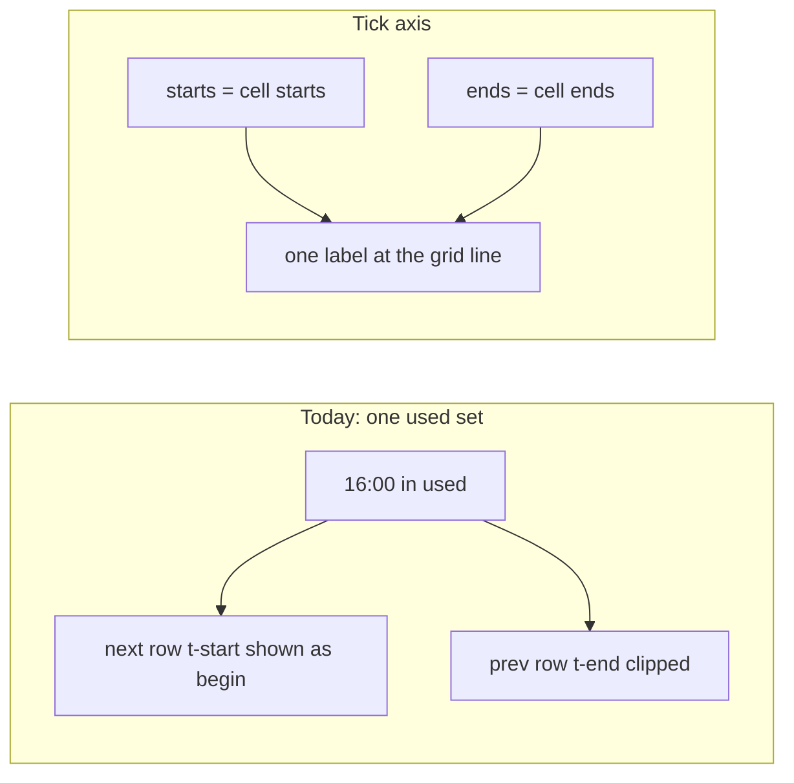

# Overview tick axis and section ends from talks

Two parts: (1) section duration from talks, (2) day-focus labels as a tick axis.

## 1. Section end = 15 min × talk count

[`data/inconsistencies.md`](data/inconsistencies.md) currently treats TimeTable/sheet envelopes as the site truth (Wed **S1 and S5 to 16:15**, S2/S6 to 16:00). That is wrong for S1: the block is stored as `14:00–16:15` but it has **8 talks**, last talk **16:00**. Timeline already follows talk times, so 16:15 is invisible there while Overview stretches S1 to the empty tail.

**Rule for `type === section`:** `end = start + sum(duration or 15)` over talks in that block. Cancelled/moved talks still count (slots do not shift). Plenary/jubilee/sponsor keep Excel `Конец`.

Current mismatches (Excel `Конец` vs packed talks):

- Wed S1: `16:15` in the book, **16:00** from 8×15
- Wed S5: `16:15`, matches 9×15 (keep)
- Tue S2 16:15 slot: `18:00` in the book, **17:45** from 6×15
- Fri S3 16:15 slot: `18:00` in the book, **17:45** from 6×15

**Build** ([`tools/build.py`](tools/build.py) after the per-talk cursor loop): if `btype == "section"` and the block has talks, set `block["end"]` to the packed cursor. Warn when that differs from the sheet `Конец` (sheet stays as-is; site follows talks). Then `python tools/build.py`.

**Docs:** rewrite the Wednesday/Friday envelope bullets in [`data/inconsistencies.md`](data/inconsistencies.md) to this rule (do not copy TimeTable merge end; duration is talk count × 15 min).

Timeline and Overview both read `block.end`, so they stay in sync. No FTP.

## 2. Tick axis (day highlight)

The remaining label bugs are one model error.

Each overview row is a slice `[a, b)` with **two** labels: `.t-start` = `a` (bold begin) and `.t-end` = `b` (muted end). [`overviewUsedTicks`](site/app.js) is a **single** set of minutes (every focused-day cell start **or** end). Then:

```js
startEl.toggle('is-idle', focus && !used.has(a));
endEl.toggle('is-idle', focus && !used.has(b));
```

An **end-only** time also turns on the **next** row’s begin label. Short slices clip the real `.t-end` (`overflow: hidden`).



**Wednesday S6 (14:00–16:00).** Nothing on Wednesday *starts* at 16:00 (coffee is 16:15). After part 1, S1 also ends 16:00; only S5 runs to 16:15.

**Saturday Closing (11:00–11:30).** 11:30 is Closing’s end, not a Saturday start. Show it as a muted **end**, not a bold begin from Mon–Fri’s 11:30 tick.

### Approach

Replace “idle if this minute is used at all” with a **tick axis** in [`viewOverview`](site/app.js) / [`applyOverviewTimeIdle`](site/app.js) / [`applyOverviewHighlight`](site/app.js) and [`site/app.css`](site/app.css).

**Membership (focused day, plus the picked cell):**

- `starts` = `dataset.start` of focused-day cells (and `sel.start` if picked)
- `ends` = `dataset.end` of focused-day cells (and `sel.end` if picked)

**One label per tick** `T` (including the last end of the day), sitting on the grid line at the **top** of the slice that begins at `T` (last tick: bottom of the last slice). No paired start+end inside every slice.

**Visibility when a day is focused**

- Hide `T` unless `starts.has(T) || ends.has(T)`
- If `starts.has(T)` → start style (bold)
- Else → end style (muted) so 16:00 and Closing 11:30 stay readable as ends
- If both (lunch 12:30) → start style only (one label)

**Pick:** accent only `sel.start` and `sel.end`. Range bar still spans `[sel.start, sel.end)`.

**Week view:** same one-label-per-tick axis. Print still strips `.is-idle` / `.is-hl`.

Bump `app.js?v=` on [`site/index.html`](site/index.html) so the service worker cannot keep the old idle logic.

## Check in the browser

- Wednesday: S1, S2, S6 cards end together at **16:00**; S5 continues to **16:15** / coffee. Day-focus shows 16:00 as an end; 16:15 as coffee start (and S5 end). Pick S6: bar 14:00–16:00
- Tuesday afternoon: S2 shorter, ends **17:45**; S3/S4/S7 to 18:00
- Friday afternoon: S3 ends **17:45**; S2/S4 to 18:00. Pick S7: **14:45** as end
- Saturday + Closing: **11:00** accent start; **11:30** muted end, not a bold begin
