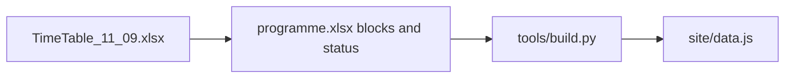

# Rooms, times, and won’t-arrive talks

Source of truth: [TimeTable&Programm_11_09.xlsx](TimeTable&Programm_11_09.xlsx) plus your confirmations. Edits go only into [data/programme.xlsx](data/programme.xlsx), then `python tools/build.py`. No FTP.

## Won’t-arrive list (orange `FFFFC000` on talk sheets)

Excluded: TimeTable section colours, plenary **открытие/закрытие** labels, empty fill on `2 Реакции` R36, sponsor rows (cyan/`theme:5`, including Бредихин).

**Oral (set `Статус` = `отменён`; keep № and block membership so later talks do not shift):**

- `P-23` Варламов В. В. — Эксперименты на пучках фотонов… (plenary, Thu)
- `S1-28` Мардыбан Е. В. — Isotopic dependence of the fission threshold… Z=114/120
- `S1-29` Безбах А. Н. — Альфа-распадные цепочки элементов 119 и 120
- `S2-01` Данилов А. Н. — Рассеяние дейтронов на 13C (your screenshot; extra cell `11.09`)
- `S2-09` Каманин Д. В. — Fissioning isomers in binary fission fragments
- `S4-09` Бытьев В. — Интегралы Фейнмана / процедура ИБП

**Posters (same orange; posters have no `Статус` today):**

- `POST-13` Долгополов — фотоядерные реакции, комптоновский источник
- `POST-19` Торилов — реакции слияния тяжёлых ядер
- `POST-21` Дормидонов — детектор на лейкосапфире
- `POST-24` Землин — диагностика пучков
- `POST-25` Комарова — сцинтилляторы для TOF-ПЭТ
- `POST-26` Кострыгина — 99mTc на протонах до 100 МэВ
- `POST-47` Ibraimova — Fluctuations and correlations in relativistic nucleus–nucleus collisions

Not orange: `S2-28` Андрей Безбах (different person from `S1-29`).

Posters: add a `Статус` column (same values as talks) in [tools/common.py](tools/common.py) / [tools/build.py](tools/build.py), strike-through + badge in [site/app.js](site/app.js) / [site/app.css](site/app.css) like oral talks. Do not delete rows.

## Room labels (per block, not on «Секции»)

Leave «Секции → Аудитория» empty (rooms rotate). Write a **code** in «Блоки → Аудитория»: `235ц` / `144ц` / `117л` / `315л`. Expand in [tools/build.py](tools/build.py) to bilingual `{ru,en}` (numbers stay Cyrillic on both languages):

- `235ц` → `235ц, Актовый зал` / `235ц, Assembly Hall`
- `144ц` → `144ц, Библиотека` / `144ц, Library`
- `117л` → `117л, Интеллектуальный центр` / `117л, Intellectual Center`
- `315л` → `315л` / `315л`

[site/app.js](site/app.js): `roomOf` / `roomLabel` must `L()` when `room` is an object. On the section hero, hide the pin when there is no default room (avoid a false «уточняется»).

**Always `235ц`:** opening, jubilee, plenary, sponsor, closing.

**Parallel slots** (TimeTable + your names):

- Mon 16:15–18:00: S1 235ц, S2 144ц, S3 117л, S7 315л
- Tue 14:00–15:45: S1 235ц, S2 144ц, S4 117л, S7 315л
- Tue 16:15–18:00: S3 235ц, S2 144ц, S4 117л, S7 315л
- Wed 14:00–16:15 S1/S5, 14:00–16:00 S2/S6: S1 235ц, S2 144ц, S5 117л, S6 315л
- Fri 14:00–15:45: S1 235ц, S3 117л, S4 144ц, S7 315л (S7 only to **14:45**)
- Fri 16:15–18:00: S2 235ц, S3 117л, S4 144ц

## Times (notation is inconsistent — use these rules)

- **Wed coffee 16:15** stays. **S1 and S5** end **16:15** (already in the book; S5 is 9×15 min exact). **S2 and S6** end **16:00** (8×15 min from 14:00). The TimeTable merge to 15:45 is wrong; keep all eight talks, no overflow warning.
- **Fri S7** → **14:00–14:45**, talks `22-24` (3×15 min fits). Move it off the current 16:15 slot.
- **Fri S2** → **16:15–18:00**, talks `30-36`, room **235ц**. Section sheet still says `14:00--15:45`; TimeTable (and room `акт. зал` at 16:15) wins.
- S3 Fri second header `16:15--15:45` is a typo → keep **16:15–18:00**.

## Also

- One row on «Изменения»: rooms published; listed talks/posters cancelled (will not attend).
- [data/inconsistencies.md](data/inconsistencies.md): rooms are no longer blank; replace «пустые аудитории» with this catalog; record the orange list; note Friday S2/S7 swap and Wed S2/S6 ending **16:00** (TimeTable 15:45 merge ignored).
- Rebuild `site/data.js` (and bundled HTML if the usual build does). Check locally (`site/index.html` or `python -m http.server 8080 --directory site`): rooms on parallel cards, EN labels, cancelled badges, Fri S7 14:00–14:45 / S2 16:15 in 235ц, Wed S2/S6 ending 16:00.
- Do **not** deploy or commit unless you ask.

