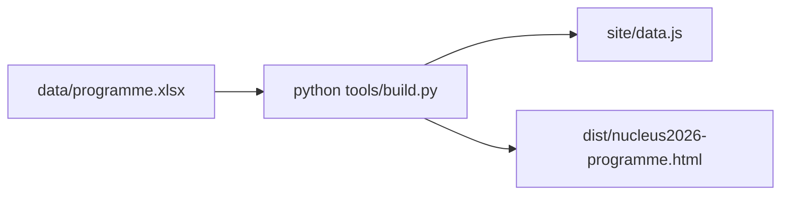

# Schedule corrections (talk swaps + affiliation)

Source of truth is [`data/programme.xlsx`](data/programme.xlsx). Per the README, **swap only the «№» column; do not change IDs** (stars in «Моё» are keyed by ID). Blocks already point at numbers (`8-13`, `14`, `31`), so the **Блоки** sheet stays as-is.

Today is Mon 21 Sep — the Izosimov clash is **tomorrow 14:00**. After the local rebuild, say if you want it uploaded to `nucleus.togudv.ru` (not part of this pass).



## Current vs after

**1. Изосимов / Шевчик (Tue 22 Sep, section 2)**

И. Н. Изосимов is double-booked **22 Sep 14:00–14:15** in two rooms:

- [`S1-08`](site/data.js) — секция 1, библиотека, 14:00–14:15 (leave this talk)
- [`S2-08`](site/data.js) — секция 2, актовый зал, 14:00–14:15, № **8**
- [`S2-12`](site/data.js) Шевчик — тот же блок B030 (`Доклады` `8-13`), сейчас 14:45–15:00, № **11**

Swap **№** only, both still section 2:

| ID | Speaker | № now | № after | Time after |
|---|---|---|---|---|
| `S2-12` | Е. А. Шевчик | 11 | **8** | 14:00–14:15, 235ц |
| `S2-08` | И. Н. Изосимов | 8 | **11** | 14:45–15:00, 235ц |

`S1-08` stays 14:00 в библиотеке. After the swap he still has two Tuesday talks 45 minutes apart (library then assembly hall) — that is the requested fix.

**2. Шитов / Ефимов (plenary Wed ↔ Sat)**

| ID | Speaker | № now | Slot now | № after | Slot after |
|---|---|---|---|---|---|
| `P-14` | М. И. Шитов | 14 | Wed 23 Sep 10:00–10:30 | **31** | Sat 26 Sep 09:30–10:00 |
| `P-30` | А. Ефимов | 31 | Sat 26 Sep 09:30–10:00 | **14** | Wed 23 Sep 10:00–10:30 |

Дзюба `P-31` (Sat 09:00, № 30) and Родкин `P-32` (Sat 10:00, № 32) stay. Efimov’s posters `POST-02`–`POST-04` stay.

**3. Affiliation Иванищев**

[`S4-16`](site/data.js) Дмитрий Александрович Иванищев, Fri 25 Sep 14:15, секция 4: **Организация** `НИЦ КИ-ПИЯФ` → `НИЦ КИ-ПИЯФ, СПбПУ`. Do not change other `НИЦ КИ-ПИЯФ` rows (e.g. `S4-23` Дьяченко).

## How to edit

Patch the **Доклады** sheet with openpyxl (same pattern as README «Поменять два доклада местами»). If Excel has the book open, write [`data/_programme_update.xlsx`](data/_programme_update.xlsx) and let [`tools/build.py`](tools/build.py) pick it up.

- Neither pair has «Начало» filled — no start-override swap.
- Add one row on **Изменения** (participants see the badge) dated 21.09, RU/EN, covering the two swaps and the affiliation line.

Then:

```text
python tools/build.py
```

Confirm in the log: no errors; block `8-13` still six talks; packed end of S2 Tue 14:00 still 15:30.

## Local check (no FTP)

Open `site/index.html` (or `python -m http.server 8080 --directory site`) and verify:

- Tue 22, секция 2 14:00: Шевчик first, Изосимов at 14:45; секция 1 14:00 still Изосимов
- Wed 10:00 plenary: Ефимов; Sat 09:30: Шитов
- Иванищев card shows `НИЦ КИ-ПИЯФ, СПбПУ`
- «Изменения» badge shows the new item

Do **not** run `python tools/deploy.py` unless you ask to publish.