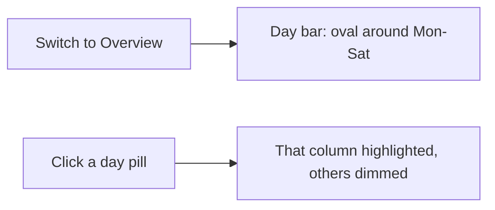

# Schedule, Overview, and print polish

All work in [`site/app.js`](site/app.js) and [`site/app.css`](site/app.css). Rebuild `dist/` after. No spreadsheet edits.

## 1. Space after the time on Sections

On [`viewSections`](site/app.js) the plenary/jubilee header concatenates two spans with no separator: `` `${b.start}–${b.end}` `` + `blockTitle(b)` → `09:30–10:00Anniversary talk`.

Make `.sec-name` `display: inline-flex; gap: 0.4em; align-items: baseline` (timeline single-line titles keep working). Insert a ` · ` between time and category in JS for that header.

## 2. Detail sheet facts: 3×2 on desktop

Talk detail tiles use [`.facts`](site/app.css) `repeat(auto-fit, minmax(150px, 1fr))`. The 680px dialog fits four columns, so six facts land as 4+2.

At `min-width: 560px` use `grid-template-columns: repeat(3, minmax(0, 1fr))`. Keep `auto-fit` below that (phone already looks right).

## 3. Remove desktop per-section chevrons

Desktop click already jumps to Sections (`isDesktop()` in `renderSectionCard`). Chevrons still show because [`.sechead .chev { display: inline-flex }`](site/app.css) (line ~542) overrides the earlier `@media (min-width: 900px) { .sechead .chev { display: none } }`.

- Move `display: none` **after** the base `.sechead .chev` rule (desktop only).
- Do not render the chevron node on desktop.
- Keep chevrons on &lt;900px (expand/collapse still lives there). Global **Show talks** stays.

## 4. Overview: week oval + column focus

Today `setDay` in overview only tints the column header (`.overview-cell.head.is-active .dom`). Clicking the already-selected day is a no-op.

**Day bar.** Wrap the six `.daypill` buttons in `.day-week`. In overview, that wrapper is a pill (`background: var(--text)` / dark: `--accent`, `border-radius: 999px`, padding ~2px) so the whole week reads as one selection. Animate background/padding with existing `--dur` / `--ease`; honor `prefers-reduced-motion`. Inner pills invert; the focused day is a nested selected pill (white/surface on the black oval).

**Grid.** `state.day` still tracks the focused column. Add `is-focus` on that day’s cells; dim other day columns slightly (`opacity: ~0.45`). Clicking Thursday always focuses Thursday even if it was already selected. Switching Timeline → Overview keeps the current day as the focused column (overview still shows the full week).

## 5. Timeline: center when collapsed, stick when open

Collapsed parallel slots stay `align-items: start`, so `14:00` sits on the top of the card row.

- `.slot:has(.parallel-grid.is-collapsed)` (and compact slots) → `align-items: center` so times + dot share the block midline.
- Expanded: `align-items: stretch` so the time column is the full slot height; keep `.slot-time { position: sticky; top: calc(var(--topbar-h) + var(--daybar-h) + 2.4rem); }` so `14:00–16:15` stays on screen while talks scroll. Do not center the times on a tall expanded slot.

## 6. Overview: merge same-kind bands and stop overlap

**Overlap cause.** Consecutive section bands (16:15, 16:45, 17:30…) each sit in a **fixed-px** tick row (~33px for 30 min) while four chips need ~100px, so cells overflow into coffee / social / the next section ([screenshot](assets)).

**Placement.** In `mergeDayBands`, keep merging plenaries as now. Also merge **adjacent section blocks** on the same day into one band from first start to last end (do not swallow coffee/lunch into that band). One cell per afternoon of sections, fewer ticks.

**Rows.** Stop locking `grid-template-rows` to fixed px. Use `minmax(<duration>, auto)` so chip stacks can grow the row. `overflow: hidden` on `.overview-cell` as a backstop. Vertically center `.overview-time` in its row.

Print uses the same merged bands (next item).

## 7. Print overview — improve live print, do not pre-render

A separate A4 pre-render (Playwright PDF / extra HTML built by `tools/build.py`) would drift from the live site and add a toolchain. The Print button already injects `@page { size: A4 landscape; margin: 8mm }`.

Fix [`renderPrintOverview`](site/app.js) to use the **merged** bands, and tighten [`.print-overview`](site/app.css):

- Same tick + rowspan model after merge (fewer rows, more likely one landscape sheet).
- `vertical-align: middle`; compact section chips; no overlapping rowspans.
- Keep `table-layout: fixed` and current landscape `@page`.

If a stand-alone PDF in `dist/` is needed later, that can be a follow-up.

## Verify

RU/EN and light/dark on each class of screen. Emulate **device pixels** in Chrome (`Emulation.setDeviceMetricsOverride`) with a realistic DPR so layout uses the CSS size below — not only the current window.

**Viewports**

- **16" high-res laptop (2880×1800, 16:10 QHD+):** DPR 2 → CSS **1440×900**. Also one pass at DPR 1.5 → CSS **1920×1200** (Windows scaling). Confirm week oval, 3×2 facts, no chevrons, overview no overlap, parallel cards 2–4 cols.
- **13" high-res laptop (2560×1600):** DPR 2 → CSS **1280×800**. Day bar + week oval must not wrap/clip; overview may scroll horizontally; timeline parallel cards only multi-column when the container ≥560px.
- **Old smartphone (1600×720 panel, 20:9 720p):** portrait **720×1600** at DPR 2 → CSS **360×800**; landscape **1600×720** at DPR 2 → CSS **800×360**. Tight height: sticky times must not sit under the day/top bars; facts stack; chevrons stay; day pills scroll; overview grid is swipe-scrollable, no overlapping cells.
- **Modern high-res smartphone (1440×3168):** DPR 3 → CSS **480×1056**. Same phone flows as above; bottom nav + safe area; detail sheet must not clip actions; no 3-col facts.

**Flows (all of the above that apply)**

- Sections P: `09:30–10:00 · Anniversary talk` (spaced)
- Talk detail: 3×2 fact tiles on laptop widths ≥560px; phone still stacked
- Desktop/laptop timeline: no `^` on section cards; click still opens Sections
- Phone timeline: chevrons stay; expand/collapse works
- Overview: week oval animates on enter; Thursday click highlights that column
- Collapsed sections: times vertically centered on the card row; expanded (laptop): times stick while scrolling
- Overview: no coffee/section/social overlap; fewer afternoon ticks
- Print overview from Overview: landscape, merged bands, readable, no stacked cells (print CSS, not viewport-dependent; spot-check once)
