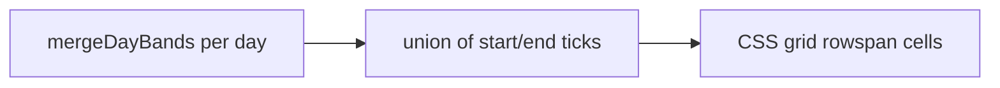

# Search, Overview axis, section alignment

All changes in [`site/app.js`](site/app.js) and [`site/app.css`](site/app.css). Rebuild `dist/` after. No spreadsheet edits.

## 1. Search

**1.1 Full names.** In `speakerIndex()` (~1013) the chip text is `` `${p.last} ${firstWord}` ``. Use `speakerName(p)` (`first + last`) so the chip reads `Александр Сергеевич Зайцев`. Keep grouping/sort by last name (letter column unchanged). Query on click already uses `speakerName(p)`.

**1.2 Clear “x”.** [`.search-box .clear`](site/app.css) is `top: 50%; transform: translateY(-50%)`, and [`.ico`](site/app.css) has `vertical-align: -0.28em`, which shifts the glyph inside the hover circle.

```css
.search-box .clear {
  inset: auto 8px 0 auto; top: 50%; margin-top: -18px; /* 36/2, no transform */
  display: grid; place-items: center;
}
.search-box .clear .ico { width: 18px; height: 18px; vertical-align: 0; margin: 0; }
```

Verify hover in the browser: glyph centered in the 36px disc.

## 2. Overview: real time axis

Rows are currently keyed by **shared start times**, and the row’s end is `max(end)` across days. That is why Monday opening at 09:00 inherits Tuesday’s plenary end (12:30), and why `09:30–12:30` sits next to `10:30–11:00`.

Keep `mergeDayBands` (plenaries merged until lunch / after lunch; short coffee between talk-like blocks swallowed). Change **placement only**.

- Collect the sorted union of every band `start` and `end` (minutes) across all days → ticks.
- CSS grid on `.overview`: column 1 = time gutter, then one column per day; `grid-template-rows: auto /* head */` + one row per tick interval.
- Each day’s band is **one cell** with `grid-row: tick(start) / tick(end)` and `grid-column` = that day. A 09:30–12:30 plenary fills that vertical span even if another day has coffee at 10:30 (that coffee only occupies Saturday’s column).
- Time gutter: label each tick (08:00, 09:00, 09:30, …), not a fake `start–maxEnd` pair. Give each interval `min-height` proportional to duration so a 3-hour plenary is visibly taller than a 30-minute coffee.
- Empty regions stay empty (no overlapping stacked rows).

Same tick + `rowspan` model in [`renderPrintOverview`](site/app.js) so landscape print matches the screen.



## 3. Parallel section cards (timeline)

**3.1 + 3.3** Headers and same-time talks must share row heights. Today each `.seccard` is an independent column, so a long 16:15 title pushes that column’s 16:30 down.

In `renderSlot` / `renderSectionCard`:

- Union of `talk.start` across the parallel blocks in that slot.
- Every card renders the same sequence: header, then one cell per time (talk or empty `.talk-slot` placeholder).
- CSS **subgrid**: `.parallel-grid` defines `grid-template-rows: auto repeat(N, auto)`; each `.seccard` is `grid-template-rows: subgrid; grid-row: 1 / -1`. Row 1 = equal-height colour headers; later rows = equal height per time. Empty cells keep the row height from the tallest talk.

**3.2** One-line title, no wrap. Replace the two-span `SECTION 1` + name with a single nowrap line: `Секция 1 · Структура ядра` / `Section 1 · Nuclear structure`. Ellipsis if the column is narrow (`white-space: nowrap; overflow: hidden; text-overflow: ellipsis` on `.sec-name`).

## 4. Timeline rail, dot, times

The line is at `left: calc(var(--rail-w) - 6px)` while `.rail-dot` uses `margin: 6px -7px 0 0`, so the stroke misses the circle. Times sit at the top of the slot, the dot lower.

- Widen `--rail-w` slightly for padding between times and the rail.
- `.slot-time`: 2-column grid — stacked `t-start` / `t-end` on the left, `.rail-dot` in the right column spanning both rows, `align-items: center` so times and the circle share one vertical center.
- Place the `::before` line at the **center of the 12px dot column** (`left: calc(var(--rail-w) - 6px)` with the dot having **zero** side margin, 12px size, 2px stroke).
- Compact slots (plenary / break / social): `.slot:not(:has(.parallel)) { align-items: center; }` so times + dot + card share one horizontal midline.
- Parallel-section slots stay `align-items: start` so 16:15 stays at the top of the block.

## Verify

Desktop + ~390px, RU/EN, light/dark:

- Search chips show full `first last`; clear × centered on hover
- Overview: Monday opening duration is that block only; plenary bands fill 09:30–12:30 without a colliding 10:30 row in the same column; print landscape still one sheet
- Parallel headers same height; `Section N · name` one line; 16:15 / 16:30 rows lined up across columns
- Rail through the dot; times + dot + plenary card vertically centered together
