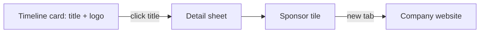

# Sponsor logos and links

Monday 21.09, 15:00–15:45 in the Assembly Hall: three sponsor cards (`P-S1` Gammatech, `P-S2` Диджитайзер, `P-S3` Научное оборудование). Org is empty today; emails already point at the companies.

## What the UI does

**Timeline** ([`renderPlenary`](site/app.js) in [`site/app.js`](site/app.js), used by the day list — not the week overview grid): keep the card as the detail opener. After the title text, put a small logo on the right of `.ptitle` (flex row, `margin-left: auto`, ~28–36px tall). The logo is an ``, not a nested `<a>` (the whole card is already `role="button"`).

**Details sheet** ([`openDetail`](site/app.js)): leave the scientific title as text. Below the speaker, add a **sponsor tile** — `<a target="_blank" rel="noopener">` with logo, company name, hostname, and the existing `external` icon. Clicking the timeline title still opens this sheet; the tile is the outbound link.

Dark theme: sit the mark on a light rounded plate so coloured logos stay readable.

Not in this pass: overview cells, print, search/section/My rows, FTP.

## Data

Add two columns on «Доклады» in [`data/programme.xlsx`](data/programme.xlsx) and list them in [`COLS_TALKS`](tools/common.py): **Сайт**, **Логотип**. [`tools/build.py`](tools/build.py) copies them onto the talk as `url` and `logo` (compact JSON drops empties for everyone else).

| ID | Сайт | Логотип | Tile name (RU / EN) |
|---|---|---|---|
| `P-S1` | https://gammatech.pro/ | `gammatech.png` (or svg) | Гамматек / Gammatech |
| `P-S2` | https://edigitizer.ru/ | `digitizer.png` | Диджитайзер / Digitizer |
| `P-S3` | https://spegroup.ru/ | `spegroup.png` | Научное оборудование / Scientific Equipment |

Company names: bilingual object `sponsorName` from new optional columns **Спонсор (RU)** / **Спонсор (EN)**, or a three-row map in `build.py` if we want fewer Excel headers. Prefer the two name columns so the workbook stays the source of truth.

Logos: save official header marks from the three sites into [`site/assets/sponsors/`](site/assets/sponsors/) during implementation (PNG or SVG, cropped, not hotlinked). Fallback if a file is missing: tile still shows name + URL, timeline shows no broken image.

## App wiring

- [`site/app.js`](site/app.js): helper `sponsorOf(talk)` → `{ url, logo, name }`. `renderPlenary` appends `sponsorLogo(talk)` inside `.ptitle`. `openDetail` inserts `sponsorTile(talk)` after `.speaker`. `onclick` on the tile is unnecessary; native `<a>` is enough. Add i18n `sponsorSite` (Сайт спонсора / Sponsor website) for the tile label/`aria-label`.
- [`site/app.css`](site/app.css): `.ptitle` flex + `.sponsor-logo`; `.sponsor-tile` as a full-width fact-like row (logo plate, name, host, external icon).
- Cache: bump [`site/index.html`](site/index.html) `?v=8` → `9`, [`site/sw.js`](site/sw.js) `CACHE` to `nucleus2026-v6`, add `./assets/sponsors/...` to `PRECACHE`.
- README: two new talk columns. One «Изменения» row is optional; skip unless you want attendees notified.

`python tools/build.py` (no FTP). Check Monday 15:00 cards in RU/EN and light/dark, then open each detail sheet and follow the three links.
