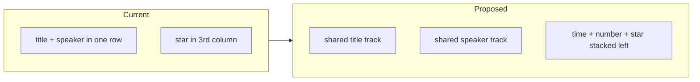

# Tune section talk cards

Same-time talks already share one CSS subgrid row per start time ([`site/app.css`](site/app.css) `.parallel-grid`). Inside each card, title and presenter still pack into that single row, so a long title sits on the name, neighbouring names do not line up, and the 40px star column forces the title into a very narrow wrap.

All three issues are solved together: drop the star column, keep a min gap above the presenter, and split each timeline talk across **two** parent tracks (title, then speaker).



## 1. Star under time/number; title gets the width

In [`site/app.js`](site/app.js) `renderTalkRow`, wrap time + star so the button is no longer a third grid column:

```html
<div class="t-meta">
  <span class="t-time">16:15 / №1</span>
  <button class="star">…</button>
</div>
<div class="t-title">…</div>
<div class="t-speaker">…</div>
```

In [`site/app.css`](site/app.css), change `.talk` from 3 columns to 2:

- `grid-template-columns: auto minmax(0, 1fr)`
- `grid-template-areas: "meta title" "meta speaker"`
- `.t-meta`: flex column, `align-items: start`, small gap (keep time/number tight; a couple of px before the star)
- Keep the 40px star hit target; it lives in the left stack so the title uses the old star column + its gap (~50px extra). Slightly increase right padding (e.g. 8px → 12px) so the title does not kiss the card edge.

Same `.talk` markup is used in Sections / Search / My, so those lists pick up the wider title and stacked star automatically. Posters and plenary cards stay as they are.

## 2. Universal min gap between title and presenter

Do **not** put this gap on `.parallel-grid` `row-gap` (that previously left unpainted white strips between cells). Keep parent `row-gap: 0`.

Use padding inside the talk so hover/`is-now` still fill the cell: `padding-top` on `.t-speaker` (~8px). That is the minimum even when the title is one line. Cards get a bit taller, as requested.

## 3. Align presenters across parallel sections

`--talk-rows` in JS stays `times.length` (number of start times). In the `@container (min-width: 560px)` expanded timeline only:

- Parent tracks: `grid-template-rows: auto repeat(var(--talk-rows, 1), auto auto)` (header + title/speaker pair per time)
- `.seccard` span: `1 / span calc(var(--talk-rows, 1) * 2 + 1)`
- Each `.seccard > .talk` and `.talk-slot.empty`: `grid-row: span 2`
- Each `.talk` there: `grid-template-rows: subgrid` so `.t-title` and `.t-speaker` sit on the **shared** parent tracks

Result: every title in a time slot shares the height of the longest title; every presenter starts on the same baseline. Short titles get extra space above the name (more than the 8px minimum). Empty slots still occupy both tracks so neighbours stay aligned.

`.t-meta` spans both talk tracks (`grid-area: meta`) with `align-self: start`, so the star stays immediately under the number and is **not** pushed down to the speaker line.

Below 560px, collapsed slots, and non-timeline lists: no nested subgrid; each card still has stacked star + min speaker padding.

## Verify (local only)

Rebuild `dist/` with `python tools/build.py`. Preview `site/index.html`. Do not FTP.

- Timeline, 3 parallel sections, mixed title lengths: presenters line up; long titles wrap with more than one word per line; star is under № and does not overlap the title.
- Hover / `is-now` fill the whole cell including the new gap (no white band).
- Empty slot next to a long title still aligns the other speakers.
- Collapsed headers, mobile stack, Sections/Search/My lists, posters, and dark mode.
